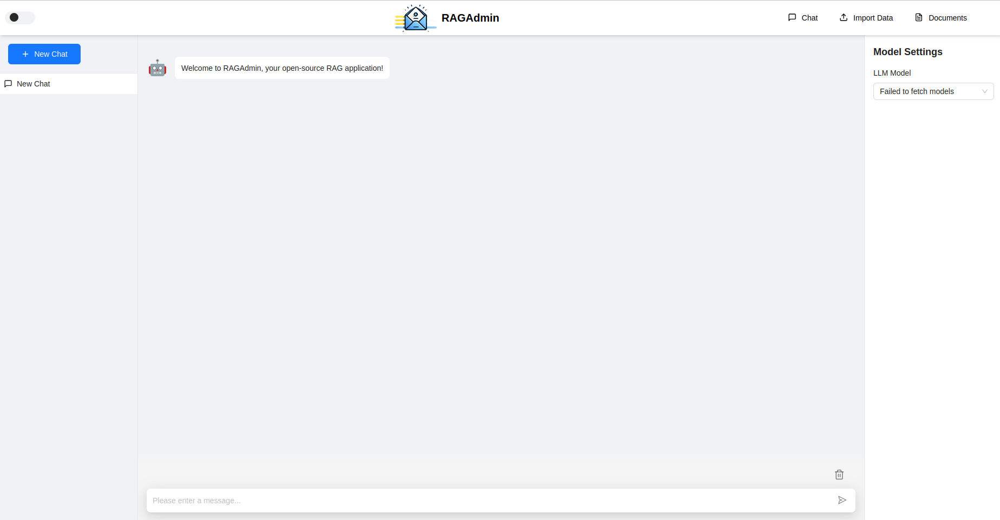

# 💫 About Me:

👋 **Hello! I'm Yassine Saddiki**

🎓 I'm a computer science student passionate about **artificial intelligence**, **cybersecurity**, and **software development**. I love exploring how technology can drive innovation and make a positive impact.

🛡️ I'm developing my cybersecurity skills through hands-on learning on platforms like [TryHackMe](https://tryhackme.com/p/nosakail).  
Follow my progress [here](https://tryhackme.com/p/nosakail).

🚀 Currently, I'm looking for a **16-week internship** to gain hands-on experience and fulfill my diploma requirements. I'm eager to apply my knowledge and collaborate on meaningful projects.
 

## 🌐 Socials:
 

# 💻 Tech Stack:
| **Category**              | **Skills**                                                                                                                                                                               |
|---------------------------|-----------------------------------------------------------------------------------------------------------------------------------------------------------------------------------|
| **WEB development**     |                                                  |
| **Mobile development**  |                                                                           |
| **Software development** |                                                              |
| **DB**                   |                                                                                      |
| **Network - Virtualization - CI/CD** |                               |
| **IDE**                   |                                                         |
| **Project Management**     |                                                                      |
| **Others**                   | 

 

## 🚀 My Last projects
### ***RAGAdmin***

RAGAdmin is a web application for communicating with a passive assistant. This tool, based on RAG (Retrieval-Augmented Generation) technology, intelligently combines
information retrieval from a document database with the generation of contextual responses via a language model (LLM). 

### *Main features*  
Conversation management: create, delete, move, view history, search and select conversations, delete messages from a conversation, rename conversations.
Other functions: activate a dark theme, insert data in database (RAGAdmin) in PDF and XML formats, view documents in database and their characteristics, select a specific template (e.g. Llama 3.2, 3.1), and delete documents in database. 

### *UI*

### *Tech Stack*  
  

### *Demonstration*  
Watch video demonstration [here](https://youtu.be/9JYqhAGk8sg)

# 📊 GitHub Stats:

<!--Contact Section--> 
<h2 align="center" >🤝 Cᴏntact Mᴇ 🤝</h2>

    <a href="mailto:yassine.saddiki@outlook.fr" target="_blank">
    

<!--Footer--> 

  

